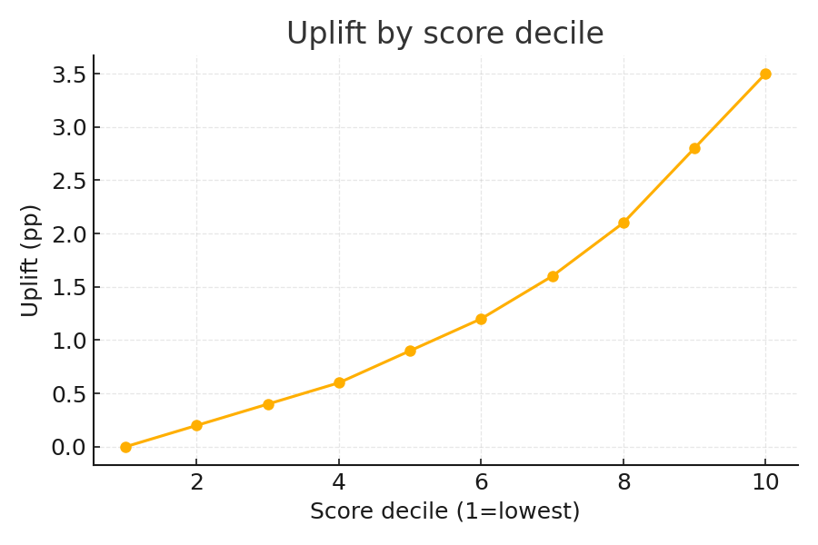

## Why it matters
- Measure real impact, not noise -- CUPED reduces variance for tighter CIs
- Guardrails prevent shipping regressions on key KPIs
- Uplift reveals who benefits most (or least)

## One-liner demo
```bash
python examples/simulate_ab.py &&     python examples/run_demo.py
```

This writes:
- assets/uplift.png -- uplift by score decile
- outputs/metrics_snapshot.json -- CUPED variance ratio & guardrail result

## Results (snapshot)
- CUPED relative variance ~35% lower
- Uplift @ top decile: ~+3-5 pp
- Guardrails: pass (no significant drop on checkout rate)


